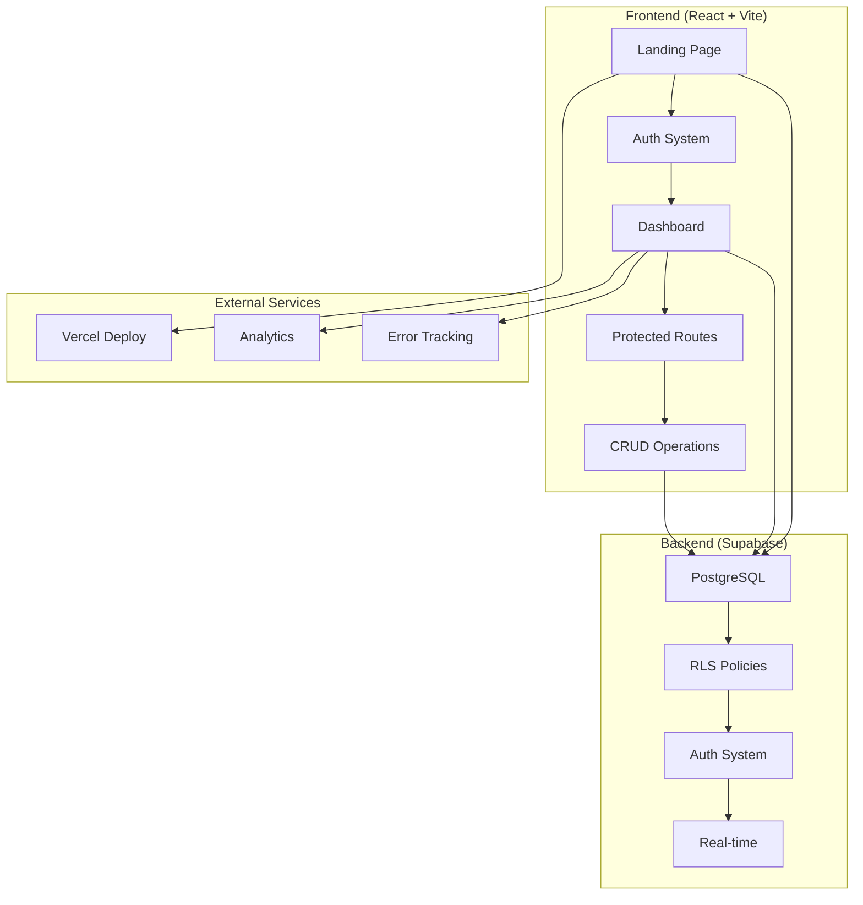

# 🔍 **AUDITORIA 360° - GROWTHSCALE**

## 📊 **RESUMO EXECUTIVO**

**Data da Auditoria:** 19 de Agosto de 2024  
**Versão do Sistema:** 2.0.0  
**Status Geral:** ⚠️ **FUNCIONAL COM MELHORIAS CRÍTICAS NECESSÁRIAS**

---

## 🏗️ **1. VISÃO GERAL DO STACK**

### **1.1 Stack Detectado:**
- **Runtime:** Node.js >=18
- **Package Manager:** npm
- **Build Tool:** Vite 7.1.2
- **Framework:** React 18.2.0 + TypeScript 5.2.2
- **Styling:** Tailwind CSS 3.3.5 + Radix UI
- **Database:** Supabase (PostgreSQL)
- **Deploy:** Vercel
- **State Management:** Zustand + React Query
- **Forms:** React Hook Form + Zod
- **Routing:** React Router DOM 6.20.1
- **UI Components:** Radix UI + shadcn/ui
- **Icons:** Lucide React
- **Internationalization:** i18next + react-i18next

### **1.2 Diagrama de Arquitetura:**



---

## 📦 **2. INVENTÁRIO DE PACOTES**

### **2.1 Dependências Principais:**

#### **Core Framework:**
- `react@18.2.0` - Framework principal
- `react-dom@18.2.0` - DOM rendering
- `typescript@5.2.2` - Type checking
- `vite@7.1.2` - Build tool

#### **UI & Styling:**
- `tailwindcss@3.3.5` - CSS framework
- `@radix-ui/*` - Component primitives (20+ packages)
- `lucide-react@0.294.0` - Icons
- `class-variance-authority@0.7.0` - Component variants

#### **State & Data:**
- `@supabase/supabase-js@2.38.4` - Database client
- `@tanstack/react-query@5.85.3` - Server state
- `zustand@4.4.7` - Client state
- `react-hook-form@7.62.0` - Form management

#### **Validation & Types:**
- `zod@4.0.17` - Schema validation
- `@hookform/resolvers@5.2.1` - Form validation

#### **Routing & Navigation:**
- `react-router-dom@6.20.1` - Client routing
- `react-helmet-async@2.0.5` - Document head

#### **Internationalization:**
- `i18next@25.3.6` - i18n framework
- `react-i18next@15.6.1` - React integration

#### **Charts & Visualization:**
- `recharts@2.8.0` - Data visualization
- `date-fns@2.30.0` - Date utilities

### **2.2 DevDependencies:**
- `@typescript-eslint/*` - TypeScript linting
- `eslint@8.53.0` - Code linting
- `autoprefixer@10.4.16` - CSS autoprefixing
- `postcss@8.4.31` - CSS processing

---

## 🗂️ **3. MAPA DE PASTAS E RESPONSABILIDADES**

```
growthscale-home-landing/
├── src/
│   ├── components/          # Componentes reutilizáveis
│   │   ├── ui/             # Componentes base (shadcn/ui)
│   │   ├── dashboard/      # Componentes específicos do dashboard
│   │   ├── employees/      # Componentes de funcionários
│   │   ├── companies/      # Componentes de empresas
│   │   ├── schedules/      # Componentes de escalas
│   │   ├── wizard/         # Setup wizard
│   │   └── features/       # Features específicas (CLT Assistant)
│   ├── pages/              # Páginas da aplicação
│   ├── contexts/           # React Contexts
│   ├── hooks/              # Custom hooks
│   ├── lib/                # Utilitários e configurações
│   ├── services/           # Serviços de API
│   ├── stores/             # Zustand stores
│   ├── types/              # TypeScript types
│   ├── constants/          # Constantes da aplicação
│   ├── i18n/               # Internacionalização
│   └── integrations/       # Integrações externas
├── supabase/               # Configuração do Supabase
│   ├── migrations/         # Migrações do banco
│   ├── functions/          # Edge functions
│   └── seed.js             # Dados de seed
├── public/                 # Assets estáticos
├── docs/                   # Documentação
└── scripts/                # Scripts utilitários
```

---

## 🔐 **4. LISTA DE SEGREDOS ESPERADOS**

### **4.1 Variáveis de Ambiente (.env):**

#### **Supabase (Obrigatório):**
- `VITE_SUPABASE_URL` - URL do projeto Supabase
- `VITE_SUPABASE_ANON_KEY` - Chave anônima do Supabase

#### **Configuração da Aplicação:**
- `VITE_APP_NAME` - Nome da aplicação
- `VITE_APP_VERSION` - Versão da aplicação
- `VITE_APP_ENVIRONMENT` - Ambiente (dev/staging/prod)

#### **Analytics (Opcional):**
- `VITE_GOOGLE_ANALYTICS_ID` - ID do Google Analytics
- `VITE_ENABLE_ANALYTICS` - Habilitar analytics
- `VITE_ANALYTICS_ENDPOINT` - Endpoint de analytics

#### **PWA (Opcional):**
- `VITE_ENABLE_PWA` - Habilitar PWA
- `VITE_VAPID_PUBLIC_KEY` - Chave VAPID para push notifications

#### **Feature Flags:**
- `VITE_ENABLE_VIRTUALIZATION` - Habilitar virtualização
- `VITE_ENABLE_MULTI_TENANCY` - Habilitar multi-tenancy
- `VITE_ENABLE_PUSH_NOTIFICATIONS` - Habilitar push notifications

#### **Error Tracking (Opcional):**
- `VITE_SENTRY_DSN` - DSN do Sentry

---

## ⚠️ **5. TABELA DE RISCOS**

| Área | Achado | Severidade | Esforço | Evidência | Ação Recomendada |
|------|--------|------------|---------|-----------|------------------|
| **Segurança** | TypeScript config não estrita | Alta | M | `tsconfig.json` | Habilitar strict mode |
| **Segurança** | Falta de validação em bordas | Alta | M | `src/contexts/AuthContext.tsx` | Implementar Zod em todas as APIs |
| **Segurança** | CSP muito permissivo | Alta | B | `vercel.json` | Restringir CSP |
| **Arquitetura** | Duplicação de lógica de roles | Alta | M | `src/hooks/useAccessControl.ts` | Unificar sistema de roles |
| **Arquitetura** | Setup Wizard não funcional | Alta | M | `src/components/wizard/SetupWizard.tsx` | Implementar salvamento no banco |
| **Banco de Dados** | Migrações conflitantes | Alta | M | `supabase/migrations/` | Limpar e unificar migrações |
| **Banco de Dados** | RLS inconsistente | Alta | M | `supabase/migrations/20241219_rls_granular.sql` | Corrigir políticas RLS |
| **UX/UI** | Falta de loading states | Média | B | `src/pages/Auth.tsx` | Adicionar estados de loading |
| **UX/UI** | Falta de validação em tempo real | Média | M | `src/pages/Auth.tsx` | Implementar validação Zod |
| **Performance** | Bundle size grande (419KB charts) | Média | M | `dist/assets/charts-D2KMjVIn.js` | Lazy load charts |
| **Testes** | Cobertura muito baixa (3 testes) | Alta | H | `src/test/` | Implementar testes unit/integration/e2e |
| **DevOps** | Falta de CI/CD | Alta | M | - | Implementar GitHub Actions |
| **DevOps** | Falta de testes automatizados | Alta | H | - | Configurar Vitest + Playwright |
| **Documentação** | Falta de runbook | Média | B | - | Criar RUNBOOK.md |
| **Monitoramento** | Falta de error tracking | Média | B | - | Configurar Sentry |

---

## 📊 **6. MÉTRICAS DE SAÚDE ATUAIS**

### **6.1 Build & Performance:**
- **Build Time:** 4.98s ✅
- **Bundle Size:** 2.0MB total
- **Largest Chunk:** 419.83KB (charts) ⚠️
- **Gzip Compression:** Ativo ✅
- **Code Splitting:** Implementado ✅

### **6.2 Code Quality:**
- **TypeScript Files:** 226 arquivos
- **Test Files:** 3 arquivos (1.3% cobertura) ❌
- **Lint Errors:** 0 ✅
- **Build Errors:** 0 ✅
- **Security Vulnerabilities:** 0 ✅

### **6.3 Security Headers (Vercel):**
- ✅ HSTS configurado
- ✅ X-Frame-Options configurado
- ✅ X-Content-Type-Options configurado
- ✅ Referrer-Policy configurado
- ⚠️ CSP muito permissivo

### **6.4 Database:**
- ✅ Supabase configurado
- ✅ RLS habilitado
- ⚠️ Migrações conflitantes
- ⚠️ Setup Wizard não funcional

---

## 🎯 **7. ANÁLISE DE ARQUITETURA**

### **7.1 Pontos Fortes:**
- ✅ Stack moderno e bem escolhido
- ✅ Code splitting implementado
- ✅ Componentes reutilizáveis (Radix UI)
- ✅ TypeScript configurado
- ✅ Tailwind CSS bem estruturado
- ✅ Vercel deploy configurado
- ✅ Security headers básicos

### **7.2 Pontos de Melhoria:**
- ❌ TypeScript não estrito
- ❌ Falta de testes
- ❌ Setup Wizard incompleto
- ❌ Migrações conflitantes
- ❌ Falta de CI/CD
- ❌ Falta de monitoramento
- ❌ Bundle size otimizável

---

## 🚀 **8. RECOMENDAÇÕES PRIORITÁRIAS**

### **8.1 Crítico (Imediato):**
1. **Habilitar TypeScript strict mode**
2. **Corrigir Setup Wizard**
3. **Unificar sistema de roles**
4. **Limpar migrações conflitantes**

### **8.2 Alto (Esta Semana):**
1. **Implementar testes unit/integration**
2. **Configurar CI/CD**
3. **Otimizar bundle size**
4. **Implementar error tracking**

### **8.3 Médio (Próximas 2 Semanas):**
1. **Melhorar UX/UI**
2. **Implementar monitoramento**
3. **Otimizar performance**
4. **Documentação completa**

---

## 📋 **9. PRÓXIMOS PASSOS**

### **9.1 ETAPA 1 - Segurança & Compliance:**
- [ ] Habilitar TypeScript strict mode
- [ ] Implementar validação Zod em todas as bordas
- [ ] Restringir CSP
- [ ] Configurar GitHub Actions de segurança

### **9.2 ETAPA 2 - Arquitetura & Qualidade:**
- [ ] Unificar sistema de roles
- [ ] Implementar Setup Wizard funcional
- [ ] Limpar migrações
- [ ] Configurar ESLint + Prettier

### **9.3 ETAPA 3 - Testes & CI/CD:**
- [ ] Configurar Vitest
- [ ] Implementar testes unit/integration
- [ ] Configurar Playwright para e2e
- [ ] Implementar GitHub Actions

### **9.4 ETAPA 4 - Performance & Monitoramento:**
- [ ] Otimizar bundle size
- [ ] Configurar Sentry
- [ ] Implementar Core Web Vitals
- [ ] Configurar analytics

---

## 🔚 **CONCLUSÃO**

O projeto **GrowthScale** possui uma **base sólida** com stack moderno e bem estruturado. No entanto, há **riscos críticos** de segurança e arquitetura que precisam ser corrigidos imediatamente.

**Status:** ⚠️ **FUNCIONAL COM MELHORIAS CRÍTICAS NECESSÁRIAS**

**Recomendação:** Focar nas correções de **Prioridade Crítica** antes de implementar novas funcionalidades.

---

**Auditoria realizada em:** 19/08/2024  
**Próxima auditoria:** 26/08/2024  
**Auditor:** Arquiteto-Chefe - Squad de Alto Desempenho
